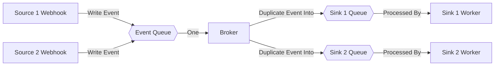

**Functional Requirements**

Normative | Req
--- | ---
MUST | Entire System should be capable of being self-hosted, with no remote dependencies
MUST | Not be tied to a particular hosting pattern (allow at least raw binary, docker compose, kubernetes as options)
MUST | A User should be able to leverage webhooks from existing \*Arr systems without modification to \*arr apps
MUST | Initially support Radarr & Lidarr at release
MUST | Initially support Discord at release
MUST | Be extensible to add new sources, whether \*arr or other portions of the ecosystem
MUST | Be configurable via UI
MUST | Utilize authentication for access to WebUI
SHOULD | Be additionally configurable pre-start (config file, env, etc)
SHOULD | Be centralized, not requiring a client
SHOULD| Give user control over where and how data is stored
SHOULD | Encrypt at rest any historical information about activity in monitored apps
SHOULD | Support rich text formats for most fields
SHOULD | Support full UTF-8 formatted strings throughout, including inside API calls & webhooks
SHOULD | Horizontally scale


### Concepts

#### Event
An Event is a generic object which can be reacted to. The `Event` object is the vehicle for delivery through the centralized event broker. Source ingestors know how to create these events based on their relevant sources, and destination Sinks know how to react to these events to deliver notifications of their occurrence. Proposed Initial Schema:
```go
type Event struct {
    Name string // Specific to the source, a human readable name for what occurred. This will be used as the Title, Subject, etc in destinations.
    Description string // A description of what occurred. This field should be limited to the text size of the smallest initial destination. This description should assume Discord's subset of markdown, and other destinations can adjust as needed.
    Image URL *string // An Image to associate with the event. Nil if no imm
    EventType enum // An enum of event types which destinations know how to react to.
    Metadata map[string]string // Arbitrary metadata about this event, which destinations should assume will be rendered as a key value table.

}
```

### Source
A Source is an object which exposes a unique webhook slug, and can receive messages specific to an individual source. This Source can expose it's own webhook format (this decision made on the assumption that different sources will have different webhook formats), and marshalls the input data into an `Event` object.

#### Sink
A Sink observes events sent from the event broker, and reacts by notifying the destination. This is intentionally left vague, Sink's generally have a reasonably broad latitude in how they react to events. Some destinations will need to spawn a thread to maintain a bot, others will simply send HTTP calls, yet others (like IRC) might communicate over a custom protocol. A sink should be limited such that it can't exceed the permissions of the overall system, and such that it cannot cross boundaries to other sinks.

#### Digest Sink
A Digest Sink does not respond to each message, but rather periodically wakes up, and leverages an event store to craft a sink comm

### Rough Model



### Semantics (The Why)
- Don't allow one destination to hold
### Thread Pools
HTTP Pool
- Sources generally do not spawn their own threads by default, they leverage a webhook slug, which is accessed via the main webhook worker pool
Broker Thread
- Broker Thread is responsible for processing the main event queue, and duplicating it into per-destination queues (is this two layer approach necessary? I think so... we don't know how long it will take to duplicate across all destinations)
Sink Threads
- Sinks naturally spawn a single thread consuming from their queue, and acting on the requests. The don't normally need a thread worker, unless event responses are expensive
Monitoring Thread
- Prometheus,

### Libraries
- Chi Router for web
-
